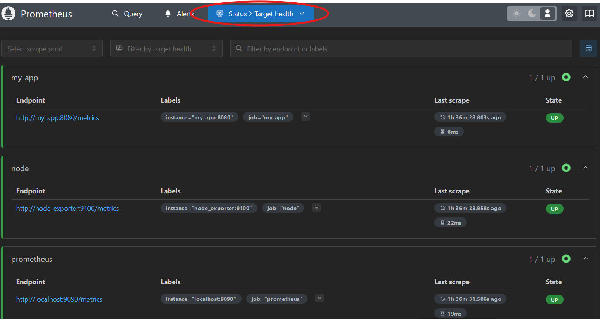
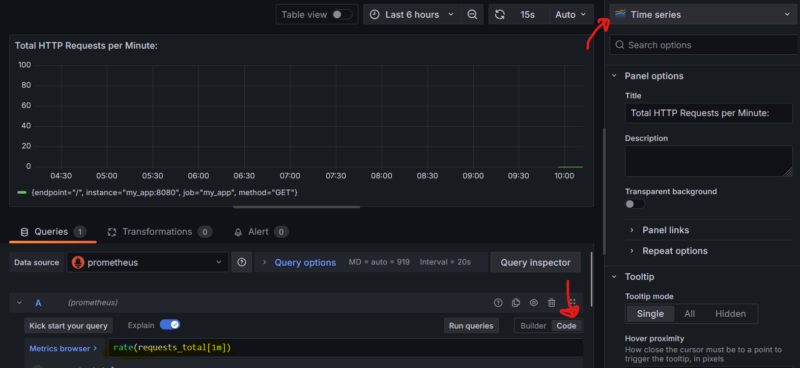
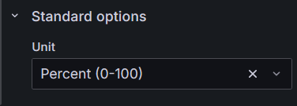

# Docker

- `docker-compose build`
- `docker-compose up`

# Check Prometheus Target Health

- Go to: http://localhost:9090/
- Go to Status > Target Health (or http://localhost:9090/targets)

# Add Prometheus as a Data Source

- Go to: http://localhost:3000
- Log in with user: admin pwd: admin 
- Change password
- Go to: Home > Connections > Data Sources.
- Add a new data source:
    - Type: Prometheus
    - URL: http://prometheus:9090
    - Leave the rest as default
    - Save & Test.

# Create a Dashboard

New Dashboard > Add > Visualization

Copy requests in the PromQL field or use the Builder. Choose the appropriate panel type.

You can change the unit in the panel options on the right, ie if you're using percentages:

### Queries used so far

Percentage of sources up (Gauge panel)
`100 * count(up == 1) / count(up)`

Incoming network by instance
`sum(rate(node_network_receive_bytes_total[5m])) by (instance)`

Outgoing network by instance
`sum(rate(node_network_transmit_bytes_total[5m])) by (instance)`

API request latency
`rate(http_request_duration_seconds_sum[5m]) / rate(http_request_duration_seconds_count[5m])`

API total requests
`rate(requests_total[1m])`

CPU usage
`100 - (avg(rate(node_cpu_seconds_total{mode="idle"}[5m])) * 100)`

Memory usage
`(1 - node_memory_MemAvailable_bytes / node_memory_MemTotal_bytes) * 100`

Total disk usage
`100 - (sum(node_filesystem_avail_bytes{fstype!~"tmpfs|overlay"}) by (instance) / sum(node_filesystem_size_bytes{fstype!~"tmpfs|overlay"}) by (instance)) * 100`

Disk usage 
`100 - ((node_filesystem_avail_bytes{fstype!~"tmpfs|overlay"} / node_filesystem_size_bytes{fstype!~"tmpfs|overlay"}) * 100)`

# Generate API calls to observe

- run _request_script/main.py_